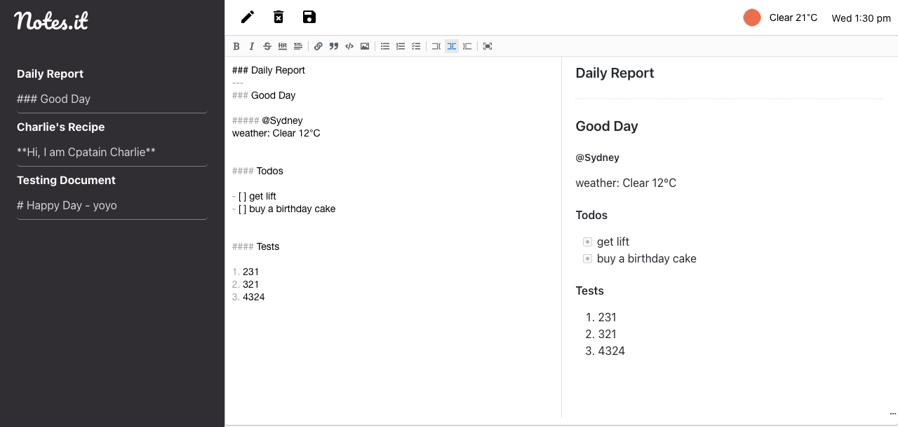

# Notes.it - a full-stack-notes-app

Full Stack Notes Taking App built on MERN stack

### Features

-   Full CRUD functionality
-   Hourly Weather Report Widget
-   Rich Markdown Editor



### Roadmaps

-   User Regisration and Authentication
-   Save note into folders
-   Note Tag
-   Search Bar
-   UI/UX refinement
-   Deploy both front and back end on cloud.

## Instruction

start both front and back end by:

**Front End**

```JavaScript
/* File Path: ./frontend */

// install all dependencies
npm install
// start the frontend react app
npm start

```

**Back End**

```JavaScript
/* File Path: ./backend */

// install all dependencies
npm install
// start the backend REST API
npm start
```

You should have "Server started" and "Conncted to database" on your console once the server runs without errors.
